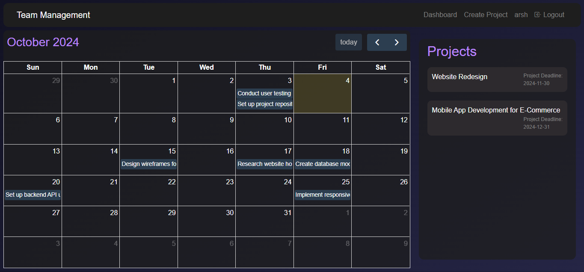
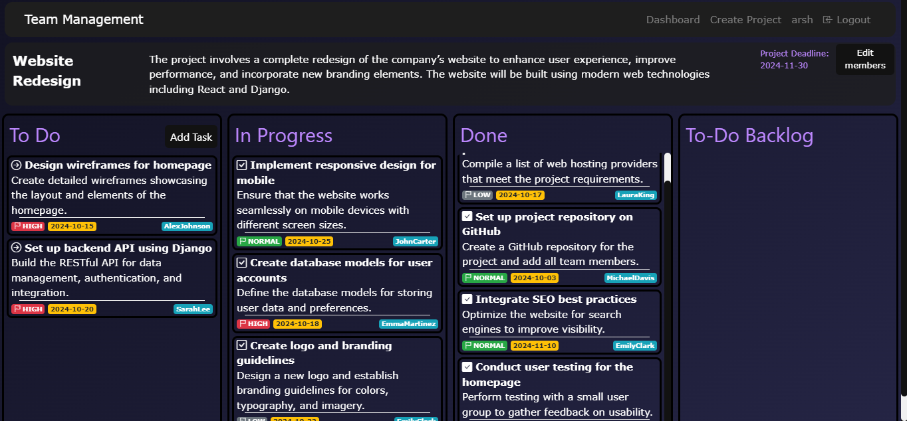

Team Project Management
A Team Project Management Website is a collaborative platform designed to help teams plan, organize, and manage their tasks effectively. The website allows team members to break down projects into smaller tasks, assign them to individuals, track progress, and ensure deadlines are met. It offers features such as task prioritization, scheduling, and progress monitoring, all in one centralized system.

 Key Features:

1. Dashboard:
   - Provides an overview to users and project managers, showing a calendar and a list of projects a user is part of, as well as projects they manage.
   - Saves time by offering all key information at a glance, including task statuses, deadlines, and project summaries.

2. Calendar View:
   - Displays all tasks assigned to a user or project manager in a timeline format.
   - Clicking on tasks reveals specific details such as the task description, deadline, priority, and assignee, offering quick insights into ongoing activities.

3. Project View:
   - Offers a detailed summary of a project, including a list of team members and the overall progress of the project.
   - Helps project managers and team members assess the current state of the project at any time.

4. Project Page:
   - Shows tasks organized into different categories such as "To Do," "In Progress," "Done," and "Backlog." 
   - Provides a clear visual representation of the project's progress and helps users understand which tasks are pending or completed.
   - Project managers can add or remove team members, create new tasks, and set attributes like task title, description, deadline, assignee, and priority.

5. Mobile Responsive:
   - The website is fully mobile-responsive, ensuring users can access and manage tasks on the go.
   - Provides flexibility for remote teams and users who need to manage projects while away from their desks.

 Benefits:

- Improved Organization: Breaks down complex projects into manageable tasks with well-defined roles and responsibilities, ensuring clarity and order.
- Transparency: All team members and project managers have real-time visibility into the project’s status, tasks, and deadlines, ensuring everyone is on the same page.
- Accountability: Assigning tasks with clear deadlines holds team members accountable for their contributions.
- Increased Productivity: With task priorities and a centralized system for tracking progress, teams can work more efficiently and reduce bottlenecks in workflows.

Distinctiveness and Complexity:
 This project requires different levels of authentication for different types of user with intergration of features accordingly.The use of modals for ui with dynamic behaviour of ui   makes a great experience. All of the pages are dynamic with help of apis in the backend. The integration of functional calendar gives a great overview with modal popup showing the info. It has error catching for the data inputed by user and works accordingly to show error to get desired inputs. Uses all methods of json input to work with data in backend. A lot of javascript is used for the dashboard and projects page to work. This includes from fetching the data with api as per user level to show information, PUT and Post to send back data.

-Folder Structure:
  - `static/tmacweb` contains all static CSS, JavaScript, and image files for each webpage. The Javascript files make the working of the data and css is used to bothe desktop and mobile styling.
    
  - `template/tmacweb` contains the HTML templates for the various web pages on the site.This folder has the layouts of the webpages which with the help of Javascript are dynamically changed.

- Models (`models.py`):
  - Defines the `Project`, `Member`, and `Task` models, with attributes required to manage project data, team members, and task details such as deadlines, priority, and assignment.
  - All linked with project id as primary to link with other models.

-Views (`views.py`):
  - Contains all the APIs and functions necessary for the core functionality of the website.
  - API requests are handled using JSON responses, which are then consumed by the front-end using JavaScript to dynamically update and interact with the webpage content.
  - Handles all the logic required for proper functioning of the website.
    
- Command to Run the Website:
  To run the website, simply use the command:  
  
  python manage.py runserver
This system provides the distinct advantage of integrating essential project management features into a single platform, making it ideal for teams of any size looking to enhance collaboration and ensure efficient project delivery.
